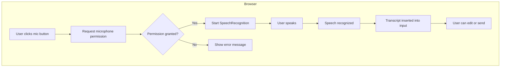

# Voice Input Feature Plan

## Status: IMPLEMENTED ✅

**Implemented:** 2025-12-31

## Overview

Add voice input capability to the Sallie web application, allowing users to speak their messages instead of typing. This feature will use the browser's Web Speech API for speech-to-text transcription.

## Current State

- **Backend**: Has a comprehensive [`VoiceSystem`](../progeny_root/Peer/core/voice.py:92) with Whisper STT and multiple TTS options
- **Frontend**: [`ChatInput.tsx`](../web/components/ChatInput.tsx:1) has text input only, no voice functionality
- **Design System**: Uses Tailwind CSS with custom [`design-tokens.ts`](../web/lib/design-tokens.ts:1) for consistent styling

## Architecture



## Implementation Plan

### 1. Create useSpeechRecognition Hook

**File**: `web/hooks/useSpeechRecognition.ts`

This custom hook will:
- Initialize the Web Speech API
- Manage recording state (idle, listening, processing, error)
- Handle browser compatibility detection
- Provide transcript and control functions
- Handle interim and final results
- Manage microphone permissions

**Interface**:
```typescript
interface UseSpeechRecognitionReturn {
  // State
  isListening: boolean;
  isSupported: boolean;
  transcript: string;
  interimTranscript: string;
  error: string | null;
  
  // Controls
  startListening: () => void;
  stopListening: () => void;
  resetTranscript: () => void;
  
  // Config
  setLanguage: (lang: string) => void;
}
```

### 2. Create VoiceMicrophoneButton Component

**File**: `web/components/VoiceMicrophoneButton.tsx`

Visual states:
- **Idle**: Gray microphone icon
- **Listening**: Pulsing purple/violet animation with microphone icon
- **Processing**: Spinner or processing indicator
- **Error**: Red icon with tooltip
- **Unsupported**: Disabled state with tooltip explaining browser requirement

**Props**:
```typescript
interface VoiceMicrophoneButtonProps {
  onTranscript: (text: string) => void;
  disabled?: boolean;
  className?: string;
}
```

### 3. Update ChatInput Component

**File**: `web/components/ChatInput.tsx`

Changes:
- Add VoiceMicrophoneButton between textarea and send button
- Handle transcript insertion (append or replace)
- Auto-focus textarea after voice input
- Visual integration with existing design

### 4. Add Voice Settings

**File**: `web/components/SettingsPanel.tsx` (update existing)

New settings:
- Voice input language selection (en-US, en-GB, es, fr, de, etc.)
- Auto-send after voice input (optional)
- Continuous listening mode (optional)

### 5. Add CSS Animations

**File**: `web/app/globals.css` (update existing)

New animations:
- Pulse animation for listening state
- Ripple effect on button press
- Smooth transitions between states

## File Structure

```
web/
├── hooks/
│   ├── useWebSocket.ts (existing)
│   ├── useKeyboardShortcuts.ts (existing)
│   └── useSpeechRecognition.ts (NEW)
├── components/
│   ├── ChatInput.tsx (UPDATE)
│   ├── VoiceMicrophoneButton.tsx (NEW)
│   └── SettingsPanel.tsx (UPDATE)
└── app/
    └── globals.css (UPDATE - add animations)
```

## Detailed Implementation

### Hook Implementation Details

```typescript
// web/hooks/useSpeechRecognition.ts

// Key implementation considerations:
// 1. Use SpeechRecognition or webkitSpeechRecognition
// 2. Set continuous = false for single utterance mode
// 3. Set interimResults = true for real-time feedback
// 4. Handle onresult, onerror, onend events
// 5. Clean up on unmount
```

### Component States

| State | Icon | Background | Animation | Aria Label |
|-------|------|------------|-----------|------------|
| Idle | 🎤 | gray-700 | none | Start voice input |
| Listening | 🎤 | violet-600 | pulse | Listening... click to stop |
| Processing | ⏳ | violet-600 | spin | Processing speech... |
| Error | 🎤 ⚠️ | red-500 | none | Voice input error |
| Unsupported | 🎤 | gray-800 | none | Voice input not supported |

### Browser Compatibility

| Browser | Support | Notes |
|---------|---------|-------|
| Chrome 33+ | Full | Best support, recommended |
| Edge 79+ | Full | Chromium-based |
| Safari 14.1+ | Partial | May require user gesture |
| Firefox | None | Web Speech API not supported |
| Opera | Full | Chromium-based |

### Keyboard Shortcuts

- **Ctrl+Shift+V** or **Cmd+Shift+V**: Toggle voice input
- **Escape**: Cancel voice input while listening

## Accessibility Requirements

1. **ARIA Labels**: Dynamic labels reflecting current state
2. **Screen Reader Announcements**: Announce state changes
3. **Keyboard Support**: Full keyboard navigation
4. **Visual Indicators**: Multiple visual cues for state (color, icon, animation)
5. **Focus Management**: Return focus to input after voice capture

## Error Handling

| Error | User Message | Recovery Action |
|-------|--------------|-----------------|
| Permission denied | Microphone access is required for voice input | Show how to enable in browser settings |
| No speech detected | No speech was detected. Please try again. | Auto-reset to idle state |
| Network error | Speech recognition requires internet connection | Suggest checking connection |
| Not supported | Voice input is not supported in this browser | Suggest Chrome or Edge |

## Testing Plan

1. **Unit Tests**:
   - useSpeechRecognition hook behavior
   - Component state transitions
   - Error handling

2. **Integration Tests**:
   - Full flow: click mic -> speak -> transcript appears
   - Permission flow
   - Settings persistence

3. **E2E Tests**:
   - Cross-browser testing (Chrome, Edge, Safari)
   - Mobile browser testing

4. **Accessibility Tests**:
   - Screen reader compatibility
   - Keyboard navigation
   - ARIA compliance

## Security Considerations

1. Microphone permission is requested only when user initiates voice input
2. Audio is processed by browser, not sent to backend
3. No audio is stored or logged
4. Clear visual indicator when microphone is active

## Future Enhancements (Out of Scope)

- Backend Whisper integration for offline/Firefox support
- Voice output (TTS for Sallie's responses)
- Wake word detection ("Hey Sallie")
- Voice commands (beyond text input)
- Multi-language support with auto-detection

## Implementation Checklist

- [x] Create `useSpeechRecognition` custom hook (`web/hooks/useSpeechRecognition.ts`)
- [x] Create `VoiceMicrophoneButton` component with all visual states (`web/components/VoiceMicrophoneButton.tsx`)
- [x] Add pulse animation CSS for listening state (`web/app/globals.css`)
- [x] Integrate voice button into `ChatInput` component (`web/components/ChatInput.tsx`)
- [x] Add browser compatibility detection with graceful degradation
- [x] Implement microphone permission handling with user-friendly errors
- [x] Add accessibility features (ARIA labels, keyboard shortcuts)
- [x] Add voice language preference to settings (`web/components/SettingsPanel.tsx`)
- [ ] Write unit and integration tests (future enhancement)
- [x] Update documentation

## Dependencies

No new npm packages required. Uses native Web Speech API.

## Risks and Mitigations

| Risk | Probability | Impact | Mitigation |
|------|-------------|--------|------------|
| Firefox users cannot use feature | Medium | Low | Clear messaging, graceful degradation |
| Inaccurate transcription | Medium | Medium | Allow editing before send |
| Permission confusion | Low | Medium | Clear onboarding, help text |
| Noisy environments | Medium | Low | Visual feedback for confidence level |
